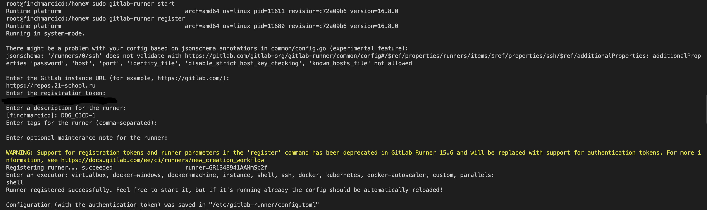
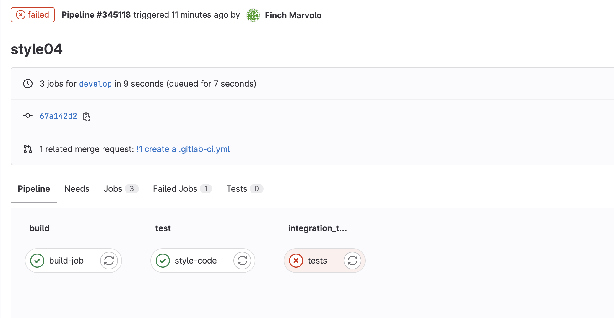

### Part 1. Настройка **gitlab-runner**

**== Задание ==**

##### Подними виртуальную машину *Ubuntu Server 22.04 LTS*.

##### Скачай и установи на виртуальную машину **gitlab-runner**.

##### Запусти **gitlab-runner** и зарегистрируй его для использования в текущем проекте (*DO6_CICD*).
- Для регистрации понадобятся URL и токен, которые можно получить на страничке задания на платформе.

### Part 2. Сборка

**== Задание ==**

#### Напиши этап для **CI** по сборке приложений из проекта *C2_SimpleBashUtils*.

##### В файле _gitlab-ci.yml_ добавь этап запуска сборки через мейк файл из проекта _C2_.

##### Файлы, полученные после сборки (артефакты), сохрани в произвольную директорию со сроком хранения 30 дней.

### Part 3. Тест кодстайла

**== Задание ==**

#### Напиши этап для **CI**, который запускает скрипт кодстайла (*clang-format*).

##### Если кодстайл не прошел, то «зафейли» пайплайн.

##### В пайплайне отобрази вывод утилиты *clang-format*.

Если кодстайл не прошел:

Если кодстайл прошел:

### Part 4. Интеграционные тесты

**== Задание ==**

#### Напиши этап для **CI**, который запускает твои интеграционные тесты из того же проекта.

##### Запусти этот этап автоматически только при условии, если сборка и тест кодстайла прошли успешно.

##### Если тесты не прошли, то «зафейли» пайплайн.

##### В пайплайне отобрази вывод, что интеграционные тесты успешно прошли / провалились.

Если тесты прошли:

Если тесты не прошли:

### Part 5. Этап деплоя

**== Задание ==**

##### Подними вторую виртуальную машину *Ubuntu Server 22.04 LTS*.

для ws2:

для первой машины:

#### Напиши этап для **CD**, который «разворачивает» проект на другой виртуальной машине.

##### Запусти этот этап вручную при условии, что все предыдущие этапы прошли успешно.

##### Напиши bash-скрипт, который при помощи **ssh** и **scp** копирует файлы, полученные после сборки (артефакты), в директорию */usr/local/bin* второй виртуальной машины.

##### В файле _gitlab-ci.yml_ добавь этап запуска написанного скрипта.

##### В случае ошибки «зафейли» пайплайн.

В результате ты должен получить готовые к работе приложения из проекта *C2_SimpleBashUtils* (s21_cat и s21_grep) на второй виртуальной машине.

### Part 6. Дополнительно. Уведомления

**== Задание ==**

##### Настрой уведомления о успешном/неуспешном выполнении пайплайна через бота с именем «[твой nickname] DO6 CI/CD» в *Telegram*.

- Текст уведомления должен содержать информацию об успешности прохождения как этапа **CI**, так и этапа **CD**.
- В остальном текст уведомления может быть произвольным.

