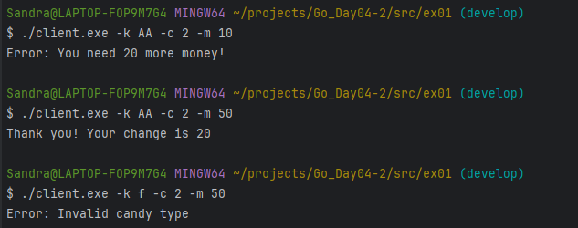

# Сервер торговых автоматов для конфет

Этот проект симулирует серверную часть для торговых автоматов конфет, позволяя клиентам совершать покупки через защищенное соединение HTTPS с взаимной аутентификацией TLS.

## Особенности

- REST API для транзакций покупки конфет.
- Защищенное TLS соединение между сервером и клиентами.
- Взаимная TLS аутентификация с самоподписанными сертификатами с использованием Minica.
- Поддержка пяти типов конфет с заранее определенными ценами.

## Предварительные требования

- Установленный язык программирования Go (Golang).
- Установленный инструмент Minica для генерации самоподписанных сертификатов.
- Базовое понимание REST API и TLS/SSL.

### Сгенерируйте сертификаты с помощью Minica для localhost:

```
   minica --domains "localhost"
```
Это создаст файл minica.pem (CA сертификат), а также cert.pem и key.pem для сервера.

## Настройка сервера

Для запуска сервера выполните:

```
   go run server.go
```
Это запустит сервер на порту 443, ожидающий подключений клиентов.

## Использование клиента

Клиент может отправлять запросы на покупку конфет с помощью предоставленного скрипта client.go. Используйте следующие флаги для указания типа конфет (-k), количества (-c) и предоставленной суммы денег (-m):

```
   go run client.go -k AA -c 2 -m 50
```

 

- Cool Eskimo (CE): 10 cents   
- Apricot Aardvark (AA): 15 cents   
- Natural Tiger (NT): 17 cents   
- Dazzling Elderberry (DE): 21 cents   
- Yellow Rambutan (YR): 23 cents

## Конечные точки API

Сервер предоставляет следующую конечную точку:

POST /buy_candy — Конечная точка для покупки конфет.

## Объяснение работы
Сервер запускается с использованием TLS и ожидает запросы на эндпоинт /buy_candy.
Клиент посылает JSON запросы на покупку конфет, передавая тип конфет, их количество и количество внесенных денег.
Сервер проверяет запрос, и если все в порядке, отвечает HTTP 201 и возвращает JSON с благодарностью и суммой сдачи.
Если в запросе указано неверное количество конфет или тип, сервер отвечает с HTTP 400.
Если недостаточно денег, сервер отвечает HTTP 402 с сообщением об ошибке.