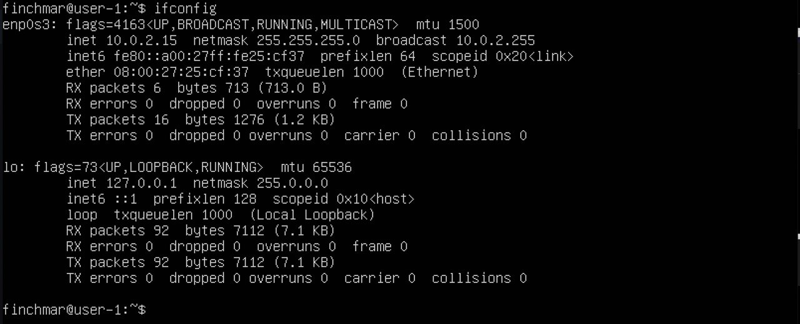
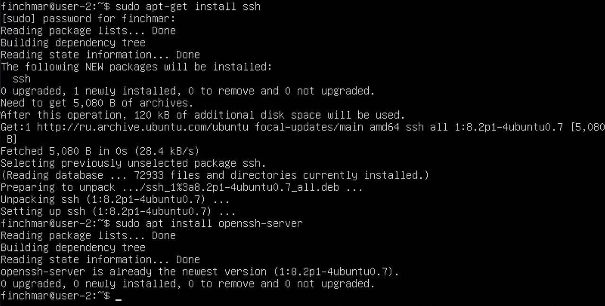
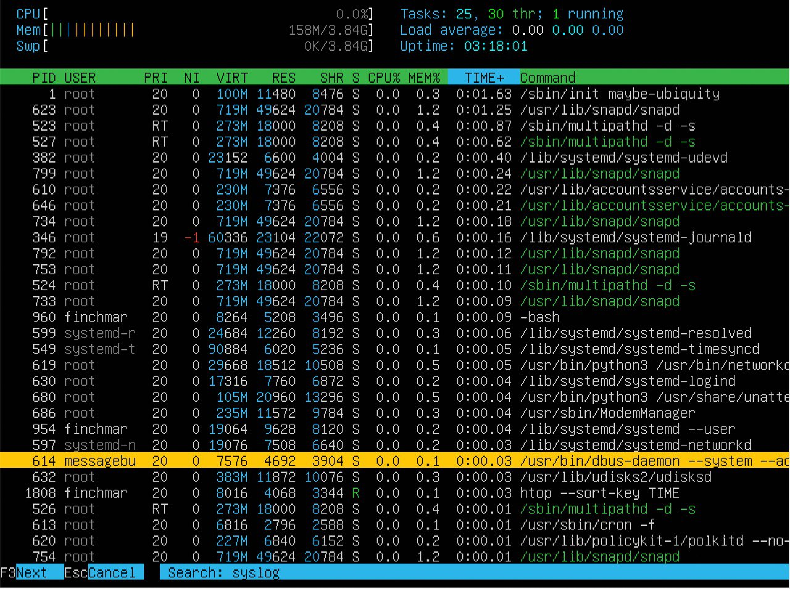
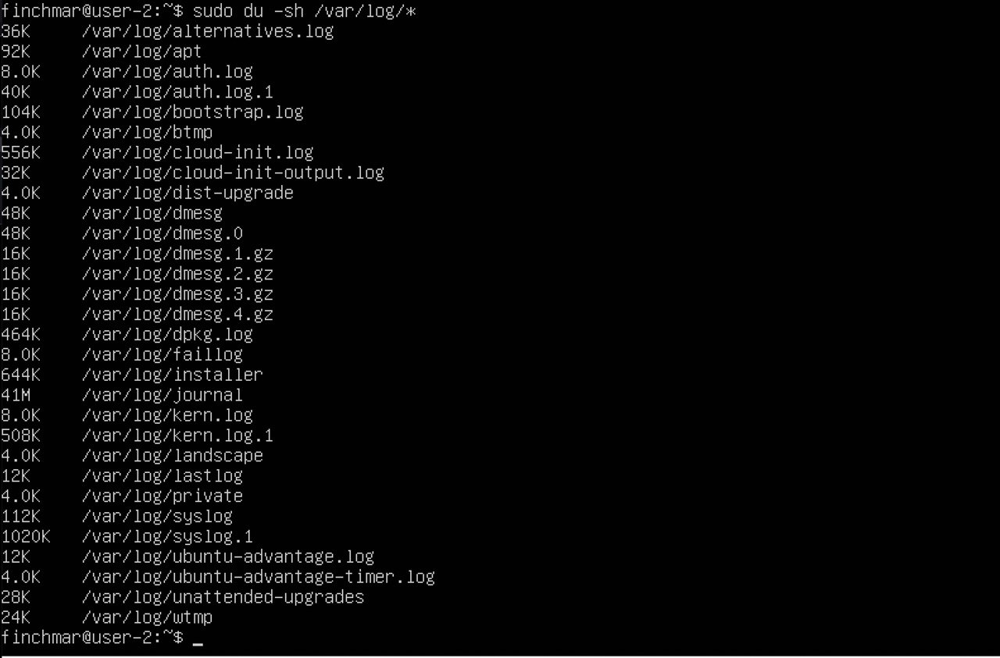
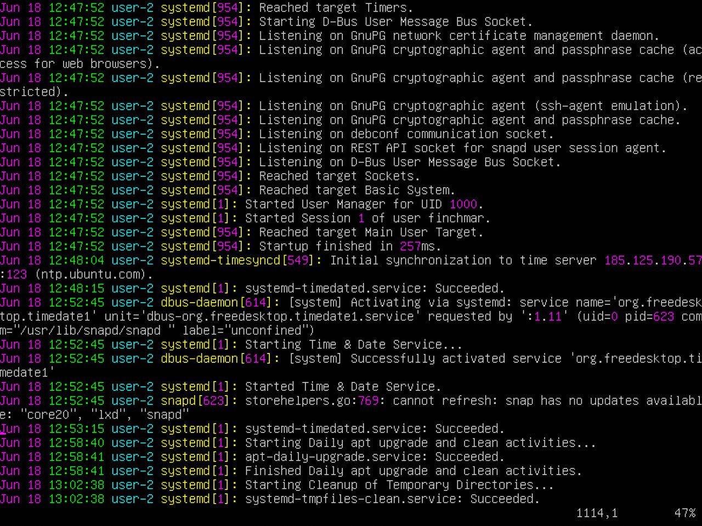

# Report

## 1. Part 1. Installation of the OS

- the Ubuntu version

`$ cat /etc/issue`

## 2. Part 2. Creating a user

- 2.1 Add a user other than the one created during installation.

`$ sudo adduser nikita`

- 2.2 Result of cat /etc/passwd command output

`$ cat /etc/passwd`

`$ cat /etc/passwd | grep nikita`

- 2.3 The user must be added to adm group

`$ sudo usermod -G adm nikita`

`$ cat /etc/group | grep adm`

## 3. Part 3. Setting up the OS network

- 3.1 Set the machine name as user-1

`$ sudo hostname user-1`

`$ hostnamectl`

- 3.2 Set the time zone corresponding to your current location.

`$ timedatectl`

`$ timedatectl list-timezones | grep Moscow`

`$ sudo timedatectl set-timezone Europe/Moscow`

`$ timedatectl`

- 3.3 Output the names of the network interfaces using a console command.

`$ ip link show`

or `$ ifconfig -a`

>lo(local loopback) – виртуальный интерфейс, присутствующий по умолчанию в любом Linux. Он используется для отладки сетевых программ и запуска серверных приложений на локальной машине. С этим интерфейсом всегда связан адрес 127.0.0.1. У него есть dns-имя – localhost.

- 3.4 To get the ip address of the device you are working on from the DHCP server.

`$ hostname -I`

or `$ ip r`

>DHCP (Dynamic Host Configuration Protocol — протокол динамической настройки узла) — сетевой протокол, позволяющий сетевым устройствам автоматически получать IP-адрес и другие параметры, необходимые для работы в сети TCP/IP.

- 3.5 The external ip address of the gateway (ip) 

`$ wget -O - -q icanhazip.com`

and the internal IP address of the gateway, aka default ip address (gw)

`$ ip route`

- 3.6 Set static (manually set, not received from DHCP server) ip, gw, dns settings (use public DNS servers, e.g. 1.1.1.1 or 8.8.8.8).

`$ sudo vim /etc/netplan/00-installer-config.yaml`

Changing the file /etc/netplan/00-installer-config.yaml

`$ sudo netplan apply` - applied changes in netplan

`$ reboot` - reboot the virtual machine

We check that the static network settings (ip, gw, dns) correspond to those set in the previous point.

`$ inconfig`

Check if remote hosts are successfully pinged 1.1.1.1 

`$ ping 1.1.1.1`

and ya.ru

`$ ping ya.ru`

# Part 4. OS Update

Update the system packages to the latest version

`$ sudo apt-get dist-upgrade`

# Part 5. Using the sudo command

>Команда sudo предоставляет возможность пользователям выполнять команды от имени суперпользователя root, либо других пользователей.

Change the OS hostname from the username created in Part 2 (using sudo).

`$ sudo hostnamectl set-hostname user-2`

`$ hostnamectl`

`$ hostname`

## Part 6. Installing and configuring the time service

Set up automatic time synchronization service

`$ sudo timedatectl`

`$ timedatectl show`

## Part 7. Installing and using text editors

## - VIM

`$ sudo apt install vim` - Install VIM text editor

`$ vim test_vim.txt` - create a test_vim.txt file

- esc 
- :wq - Exit with saving
- Enter 

- esc
- :q! - Exit without saving
- Enter

- /'What we want to find' - Search

- s/'WHAT'/'WHAT' - Replacement

## - JOE

`$ sudo apt install joe` - Install JOE text editor

`$ joe test_joe.txt` - create a test_joe.txt file

- Ctrl+K, Q, Y - Exit with saving

- Ctrl+K, Q, N - Exit without saving

- Ctrl+K, F - Search

- Ctrl+K, F, R, Y - Replacement

## - MCEDIT

`$ sudo apt install mcedit` - Install MCEDIT text editor

`$ mcedit test_mcedit.txt` - create a test_mcedit.txt file

- F2 /YES /F10 - Exit with saving

- F10 /NO - Exit without saving

- F7 /'What are we looking for' /OK || FIND ALL - Search

- F4 /'WHAT'/'WHAT'  /REPLACE || ALL - Replacement

## Part 8. Installing and basic setup of the SSHD service

`$ netstat -tan`

- 8.1 Install the SSHd service

`$ sudo apt-get install ssh`

`$ sudo apt install openssh-server`

- 8.2  Add an auto-start of the service whenever the system boots

`$ sudo systemctl enable ssh`

`$ systemctl status ssh`

- 8.3 Reset the SSHd service to port 2022.

`$ sudo nano /etc/ssh/sshd_config`

Edit the file /etc/ssh/sshd_config

- 8.4 Show the presence of the sshd process using the ps command. To do this, you need to match the keys to the command.

>ps - Вывести информацию об активных процессах;

>ps -e или ps -A(a) - Вывести информацию обо всех процессах;

>ps -a - Выбрать все процессы, кроме фоновых;

>ps -d(g) - Вывести информацию обо всех процессах, кроме лидеров групп;

>ps -N - Выбрать все процессы кроме указанных;

>ps -С - Выбирать процессы по имени команды;

>ps -G - Выбрать процессы по ID группы;

>ps -t - Выдавать информацию только о процессах, ассоциированных с терминалами из заданного списка_терминалов. Терминал - это либо имя файла-устройства, например ttyномер или console, либо просто номер, если имя файла начинается с tty;

>ps -p 'pid' - Выбрать процессы PID;;

>ps --ppid - Выбрать процессы по PID родительского процесса;

>ps -s - Выбрать процессы по ID сессии;

>ps -u - Выбрать процессы пользователя;

>ps -ef - Вывести полный список;

Show presence of sshd process

`$ ps aux | grep sshd`

or `$ ps -e | grep sshd`

- 8.5 Reboot the system.

`$ service ssh restart`

`$ reboot`

`$ netstat -tan`

>-t - Отображает только соединения TCP

>-a - Вывод всех активных подключений TCP и прослушиваемых компьютером портов TCP и UDP

>-n - Вывод активных подключений TCP с отображением адресов и номеров портов в числовом формате без попыток определения имен

>Proto: Протокол соединения

>recv-Q: Очередь получения сети

>send-Q: Сетевая очередь отправки

>Local Address: IP-адрес локального компьютера и номер используемого порта

>Foreign Address: IP-адрес и номер порта удаленного компьютера, подключенного к данному сокету

>State: Состояние TCP-соединения

>0.0.0.0: Клиентские устройства, такие как ПК, показывают адрес 0.0.0.0, когда они не подключены к какой-либо сети TCP / IP. Устройство может получить этот адрес по умолчанию, если оно не в сети. В случае сбоев назначения адреса, он может быть автоматически назначен DHCP. На случай, если ваше устройство настроено на этот адрес, оно не может общаться с любыми другими устройствами в сети через IP.

# Part 9. Installing and using the top, htop utilities:

- 9.1 Install and run the top and htop utilities

`$ sudo apt install htop`

`$ top`

- uptime - 2:07;

- количество авторизованных пользователей - 1;

- общая загрузка системы - 0.00, 0.00, 0.00;

- общее количество процессов - 90;

- загрузка cpu - 0.0%;

- загрузка памяти - 157Mб;

`$ top -o %MEM`

- pid процесса занимающего больше всего памяти - 623 

`$ top -o %CPU`

- pid процесса, занимающего больше всего процессорного времени - 1785 

- 9.2

## sort by PID

`$ htop --sort-key PID`

## sort by PERCENT_CPU

`$ htop --sort-key PERCENT_CPU`

## sort by PERCENT_MEM

`$ htop --sort-key PERCENT_MEM`

## sort by TIME

`$ htop --sort-key TIME`

## Filter 'sshd'

`$ htop`

- F4

## Search 'syslog'

- F3

## with hostname, clock and uptime output added

- F2

## Part 10. Using the fdisk utility

`$ sudo fdisk -l`

- Название диска: VBOX HARDDISK

- Размер: 50.47 GiB

- Количество секторов: 105816064

- Размер swap: 3.8G

`$ free -h`

## Part 11. Using the df utility

`$ df`

- Размер раздела - 51758528;

- Размер занятого пространства - 6928420;

- Размер свободного пространства - 42168476;

- Процент использования - 15%;

- Единица измерения в выводе - килобайт.

`$ df -Th`

- Размер раздела - 50G;

- Рразмер занятого пространства - 6.7G;

- Размер свободного пространства - 41G;

- Процент использования - 15%

- Тип файловой системы для раздела - ext4.

## Part 12. Using the du utility

Output the size of the /home, /var, /var/log folders

in human readable format

`$ sudo du -sh /var/log /home /var`  

in bytes

`$ sudo du -s --block-size=1 /var/log /home /var` 

Output the size of all contents in /var/log (not the total, but each nested element using *)

`$ sudo du -sh /var/log/*` 

## Part 13. Installing and using the ncdu utility

Install the ncdu utility

`$ sudo apt install ncdu`

Output the size of the /home, /var, /var/log folders

`$ sudo ncdu /home`

`$ sudo ncdu /var`

`$ sudo ncdu /var/log`

## Part 14. Working with system logs

- 14.1 /var/log/dmesg

Open for viewing:

`$ sudo vim /var/log/dmesg`

- 14.2 /var/log/syslog

`$ sudo vim /var/log/syslog`

- 14.3 /var/log/auth.log

`$ sudo vim /var/log/auth.log`

- Последняя успешная авторизация: Jun 18 19:46:29;

- Имя пользователя: finchmar;

- Метод входа в систему: pam-unix.

- 14.4 Restart the SSHd service

`$ sudo systemctl restart ssh`

`$ cat /var/log/syslog | grep ssh`

## Part 15. Using the CRON job scheduler

Using the job scheduler, run the uptime command in every 2 minutes

`$ sudo crontab -e`

Find lines in the system logs (at least two in a given time range) about the execution.

`$ grep -i cron /var/log/syslog`

Display a list of current jobs for CRON

`$ sudo crontab -l`

Remove all tasks from the job scheduler

`$ sudo crontab -r`

`$ sudo crontab -l`

