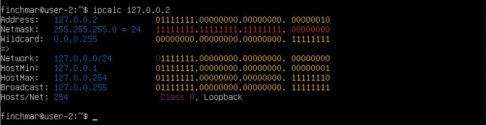
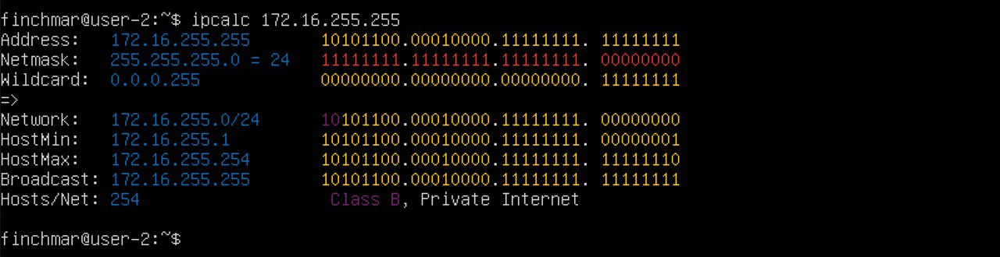
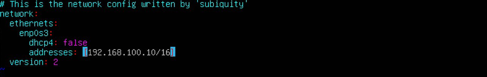
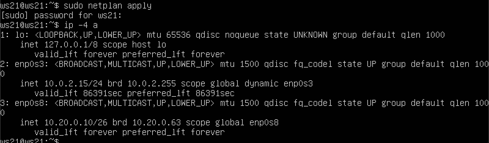
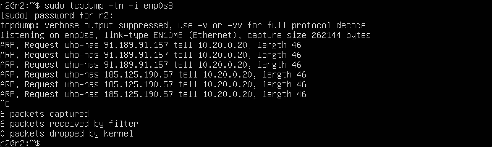
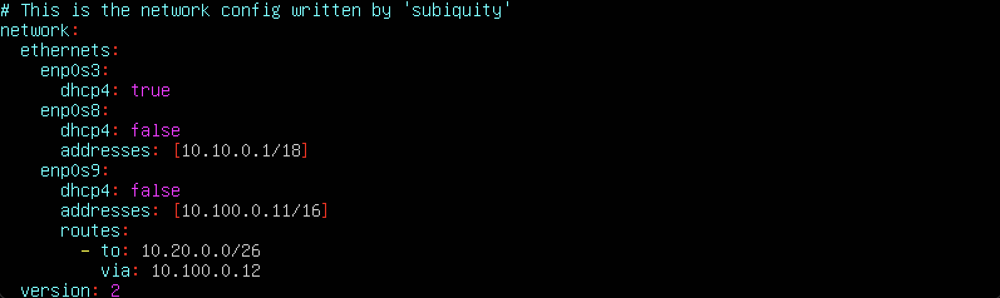
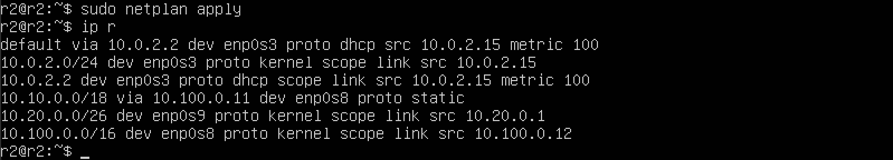
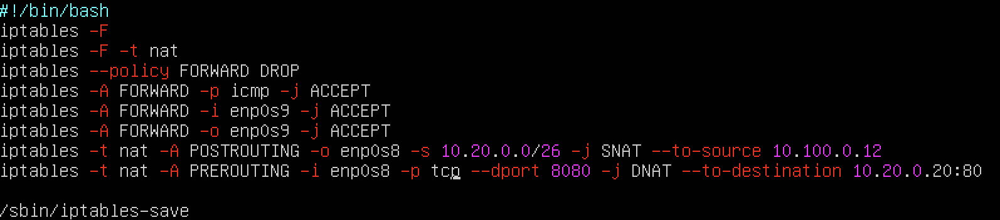

## Part 1. Инструмент ipcalc

### 1.1. Сети и маски

`$ sudo apt install ipcalc`

 

`$ ipcalc 192.167.38.54/13`

адрес сети 192.167.38.54/13 - 192.160.0.0/13

 

перевод маски 255.255.255.0 в префиксную и двоичную запись, /15 в обычную и двоичную, 11111111.11111111.11111111.11110000 в обычную и префиксную

`$ ipcalc 0.0.0.0/255.255.255.0`

prefix - /24

binary - 11111111.11111111.11111111.00000000 

`$ ipcalc 0.0.0.0/15`

normal - 255.254.0.0

binary - 11111111.1111111 0.00000000.00000000

 

`$ ipcalc 0.0.0.0/28`

normal - 255.255.255.240

prefix - /28

 

минимальный и максимальный хост в сети 12.167.38.4 при масках: /8, 11111111.11111111.00000000.00000000, 255.255.254.0 и /4

`$ ipcalc 12.167.38.4/8`

minimum host - 12.0.0.1
 
maximum host - 12.255.255.254

`$ ipcalc 12.167.38.4/255.255.0.0`

minimum host - 12.167.0.1
 
maximum host - 12.167.255.254

")

`$ ipcalc 12.167.38.4/255.255.254.0`

minimum host - 12.167.38.1
 
maximum host - 12.167.39.254

`$ ipcalc 12.167.38.4/4`

minimum host - 0.0.0.1
 
maximum host - 15.255.255.254

### 1.2. localhost

Определить и записать в отчёт, можно ли обратиться к приложению, работающему на localhost, со следующими IP: 194.34.23.100, 127.0.0.2, 127.1.0.1, 128.0.0.1

`$ ipcalc 194.34.23.100` - no

`$ ipcalc 127.0.0.2` - yes

`$ ipcalc 127.1.0.1` - yes

`$ ipcalc 128.0.0.1` - no

### 1.3. Network ranges and segments

какие из перечисленных IP можно использовать в качестве публичного, а какие только в качестве частных: 10.0.0.45, 134.43.0.2, 192.168.4.2, 172.20.250.4, 172.0.2.1, 192.172.0.1, 172.68.0.2, 172.16.255.255, 10.10.10.10, 192.169.168.1

`$ ipcalc 10.0.0.45` - private

 

`$ ipcalc 134.43.0.2` - public

`$ ipcalc 192.168.4.2` - private

`$ ipcalc 172.20.250.4` - private

`$ ipcalc 172.0.2.1` - public

`$ ipcalc 192.172.0.1` - public

`$ ipcalc 172.68.0.2` - public

`$ ipcalc 172.16.255.255` - private

`$ ipcalc 10.10.10.10` - private

`$ ipcalc 192.169.168.1` - public

какие из перечисленных IP адресов шлюза возможны у сети 10.10.0.0/18: 10.0.0.1, 10.10.0.2, 10.10.10.10, 10.10.100.1, 10.10.1.255

`$ ipcalc 10.10.0.0/18`

10.10.0.1 - 10.10.63.254 (possible 10.10.0.2, 10.10.10.10, 10.10.1.255)

## Part 2. Статическая маршрутизация между двумя машинами

Поднять две виртуальные машины (далее -- ws1 и ws2)

`$ ip a` - for ws1

`$ ip a` - for ws2

Описать сетевой интерфейс, соответствующий внутренней сети, на обеих машинах и задать следующие адреса и маски: ws1 - 192.168.100.10, маска /16, ws2 - 172.24.116.8, маска /12

`$ sudo vi /etc/netplan/00-installer-config.yaml`

-- ws1

`$ sudo vi /etc/netplan/00-installer-config.yaml`

-- ws2

Выполнить команду `$ netplan apply` для перезапуска сервиса сети

`$ sudo netplan apply`

С помощью команды `$ ip a` посмотреть существующие сетевые интерфейсы

`$ ip a` - for ws1

`$ ip a` - for ws2

### 2.1. Adding a static route manually

Добавить статический маршрут от одной машины до другой и обратно при помощи команды вида `$ ip r add`.

`$ sudo ip route add 172.24.116.8 dev enp0s3`

`$ ping 172.24.116.8`

`$ sudo ip route add 192.168.100.10 dev enp0s3`

`$ ping 192.168.100.10`

### 2.2. Adding a static route with saving

Перезапустить машины

`$ reboot` - for ws1, ws2

Добавить статический маршрут от одной машины до другой с помощью файла etc/netplan/00-installer-config.yaml

`$ sudo vi /etc/netplan/00-installer-config.yaml`

-- ws1

`$ sudo vi /etc/netplan/00-installer-config.yaml`

-- ws2

Пропинговать соединение между машинами

`$ sudo netplan apply`

`$ ping 172.24.116.8`

`$ sudo netplan apply`

`$ ping 192.168.100.10`

## Part 3. Утилита iperf3

### 3.1. Скорость соединения

Перевести и записать в отчёт: 8 Mbps в MB/s, 100 MB/s в Kbps, 1 Gbps в Mbps

8 Mbps = 1MB/s, 100 MB/s = 800 000 Kbps, 1 Gbps = 1000 Mbps

### 3.2. Утилита iperf3

Измерить скорость соединения между ws1 и ws2

for ws1:

`$ sudo apt install iperf3`

Создадим сервер на ws1 командой:

`$ iperf3 -s`

for ws2:

`$ sudo apt install iperf3`

Давайте создадим клиент ws2, который отправляет запрос на сервер, который мы создали ранее.

`$ iperf3 -c 192.168.100.10`

sender: 4.83 Gbits/sec

receiver: 4.83 Gbits/sec

## Part 4. Сетевой экран

### 4.1. Утилита iptables

Создать файл /etc/firewall.sh, имитирующий фаерволл, на ws1 и ws2:

`$ sudo touch /etc/firewall.sh`

`$ sudo vi /etc/firewall.sh` 

Нужно добавить в файл подряд следующие правила:

1) на ws1 применить стратегию когда в начале пишется запрещающее правило, а в конце пишется разрешающее правило (это касается пунктов 4 и 5)

2) на ws2 применить стратегию когда в начале пишется разрешающее правило, а в конце пишется запрещающее правило (это касается пунктов 4 и 5)

3) открыть на машинах доступ для порта 22 (ssh) и порта 80 (http)

4) запретить echo reply (машина не должна "пинговаться”, т.е. должна быть блокировка на OUTPUT)

5) разрешить echo reply (машина должна "пинговаться")

-- ws1

-- ws2

Запустить файлы на обеих машинах командами chmod +x /etc/firewall.sh и /etc/firewall.sh.

- ws1

`$ sudo chmod +x /etc/firewall.sh`

`$ sudo bash /etc/firewll.sh`

`$ sudo iptables -L OUTPUT -nv`

`$ ping 172.24.116.8`

- ws2

`$ sudo chmod +x /etc/firewall.sh`

`$ sudo bash /etc/firewll.sh`

`$ sudo iptables -L OUTPUT -nv`

`$ ping 192.168.100.10`

>iptables читает правила в цепочках последовательно и применяет первое возможное к применению, последующие игнорируются. Так как как на ws-1 сначало записано запрещающее правило на *echo reply*, то оно и применится, на ws-2 наоборот применится разрещающее правило на *echo reply*, как первое возможное для применения. Проверить это можно попытавшись пропинговать машины друг с друга. Как видно из скринов выше, ожидаемое поведение полностью подтверждается, ws-1 не пингуется с ws-2, а ws-2 с ws-1 пингуются.

### 4.2. Утилита nmap

Командой ping найти машину, которая не "пингуется", после чего утилитой nmap показать, что хост машины запущен

`$ ping 172.24.116.8`

`$ ping 192.168.100.10`

в выводе nmap должно быть сказано: `Host is up`

`$ sudo apt-get install nmap`

`$ sudo nmap 192.168.100.10`

## Part 5. Статическая маршрутизация сети

Поднять пять виртуальных машин (3 рабочие станции (ws11, ws21, ws22) и 2 роутера (r1, r2))

### 5.1. Настройка адресов машин 

Настроить конфигурации машин в etc/netplan/00-installer-config.yaml согласно сети на рисунке.

-- ws11 

-- ws21 

-- ws22 

-- r1 

-- r2 

Перезапустить сервис сети. Если ошибок нет, то командой ip -4 a проверить, что адрес машины задан верно. Также пропинговать ws22 с ws21. Аналогично пропинговать r1 с ws11.

-- ws11 

-- ws21 

-- ws22 

-- r1 

-- r2 

-- ping ws22 c ws21 

-- ping r1 c ws11 

### 5.2. Включение переадресации IP-адресов. 

Для включения переадресации IP, выполните команду на роутерах:

`$ sysctl -w net.ipv4.ip_forward=1`

При таком подходе переадресация не будет работать после перезагрузки системы.

Откройте файл /etc/sysctl.conf и добавьте в него следующую строку:

- net.ipv4.ip_forward = 1

При использовании этого подхода, IP-переадресация включена на постоянной основе.

### 5.3. Установка маршрута по-умолчанию

Настроить маршрут по-умолчанию (шлюз) для рабочих станций. Для этого добавить default перед IP роутера в файле конфигураций 

-- ws11 

-- ws21 

-- ws22 

Вызвать ip r и показать, что добавился маршрут в таблицу маршрутизации 

-- ws11 

-- ws21 

-- ws22 

Пропинговать с ws11 роутер r2 и показать на r2, что пинг доходит. Для этого использовать команду: `$ tcpdump -tn -i eth1`

-- ping 10.100.0.12 

### 5.4. Добавление статических маршрутов

Добавить в роутеры r1 и r2 статические маршруты в файле конфигураций. Пример для r1 маршрута в сетку 10.20.0.0/26:

-- r1 

-- r2 

Вызвать ip r и показать таблицы с маршрутами на обоих роутерах. 

-- r1 

-- r2 

Запустить команды на ws11: 

`$ ip r list 10.10.0.0/[маска сети]` и `$ ip r list 0.0.0.0/0`

- Маршрут по умолчанию имеет более низкий приоритет и срабатывает, когда не найден подходящий маршрут в таблице маршрутизации. Для сети 10.10.0.0 мы создали правило, соответственно используется созданный маршрут. Также можно устанавливать метрику, чтобы менять приоритеты маршрутов. 

### 5.5. Построение списка маршрутизаторов 

Запустить на r1 команду дампа: 

`$ tcpdump -tnv -i eth0`

При помощи утилиты traceroute построить список маршрутизаторов на пути от ws11 до ws21. 

`$ sudo apt install traceroute` 

-- Запустить на r1 команду дампа: sudo tcpdump -tnv -i enp0s8 

-- Одновременно с запуском r1 пингуем ws11 c ws21: на машине ws11 вводим команду ping -c 4 10.20.0.10(машина ws21). 

-- После вводим команду `$ sudo traceroute 10.20.0.10` 

-- Принцип построения пути при помощи traceroute:  

Для определения промежуточных маршрутизаторов traceroute отправляет серию пакетов данных целевому узлу, при этом каждый раз увеличивая на 1 значение поля TTL («время жизни»). Это поле обычно указывает максимальное количество маршрутизаторов, которое может быть пройдено пакетом. Первый пакет отправляется с TTL, равным 1, и поэтому первый же маршрутизатор возвращает обратно сообщение ICMP, указывающее на невозможность доставки данных. Traceroute фиксирует адрес маршрутизатора, а также время между отправкой пакета и получением ответа (эти сведения выводятся на монитор компьютера). Затем traceroute повторяет отправку пакета, но уже с TTL, равным 2, что позволяет первому маршрутизатору пропустить пакет дальше.  
Процесс повторяется до тех пор, пока при определённом значении TTL пакет не достигнет целевого узла. При получении ответа от этого узла процесс трассировки считается завершённым. 

### 5.6. Использование протокола ICMP при маршрутизации 

Запустить на r1 перехват сетевого трафика, проходящего через eth0 с помощью команды: 

`$ tcpdump -n -i eth0 icmp`

Пропинговать с ws11 несуществующий IP (например, 10.30.0.111) с помощью команды: 

`$ ping -c 1 10.30.0.111`

## Part 6. Динамическая настройка IP с помощью DHCP

Для r2 настроить в файле /etc/dhcp/dhcpd.conf конфигурацию службы DHCP: 

`$ sudo apt-get install isc-dhcp-server -y`
1) указать адрес маршрутизатора по-умолчанию, DNS-сервер и адрес внутренней сети.

2) в файле resolv.conf прописать nameserver 8.8.8.8.

Перезагрузить службу DHCP командой `$ systemctl restart isc-dhcp-server`. Машину ws21 перезагрузить при помощи `$ reboot` и через `$ ip a` показать, что она получила адрес. Также пропинговать ws22 с ws21. 

-- Перезагружаем службу DHCP 

-- Машину ws21 перезагрузить при помощи команды sudo reboot, вводим команду ip a 

-- ping ws22 c ws21 

Указать MAC адрес у ws11, для этого в etc/netplan/00-installer-config.yaml надо добавить строки: macaddress: 10:10:10:10:10:BA, dhcp4: true 

Для r1 настроить аналогично r2, но сделать выдачу адресов с жесткой привязкой к MAC-адресу (ws11). Провести аналогичные тесты

-- указываем адрес маршрутизатора по-умолчанию, DNS-сервер и адрес внутренней сети.

-- в файле resolv.conf прописываем nameserver 8.8.8.8.

-- Перезагружаем службу DHCP командой `$ systemctl restart isc-dhcp-server`

-- Машину ws11 перезагружаем при помощи `$ sudo reboot` и вводим команду `$ ip a`.

Запросить с ws21 обновление ip адреса

-- ip до обновления

-- ip после обновления 

`$ sudo dhclient -r enp0s8` - удалить ip-адрес

`$ sudo dhclient enp0s8` - обновить ip-адрес

## Part 7. NAT 

В файле /etc/apache2/ports.conf на ws22 и r1 изменить строку Listen 80 на Listen 0.0.0.0:80, то есть сделать сервер Apache2 общедоступным

-- r1 

-- ws22 

Запустить веб-сервер Apache командой `$ service apache2 start` на ws22 и r1 

-- r1 

-- ws22 

Добавить в фаервол, созданный по аналогии с фаерволом из Части 4, на r2 следующие правила:

1) удаление правил в таблице filter - iptables -F

2) удаление правил в таблице "NAT" - iptables -F -t nat

3) отбрасывать все маршрутизируемые пакеты - iptables --policy FORWARD DROP

Запускать файл также, как в Части 4 

Проверить соединение между ws22 и r1 командой ping 
При запуске файла с этими правилами, ws22 не должна "пинговаться" с r1

Добавить в файл ещё одно правило: 

4) разрешить маршрутизацию всех пакетов протокола ICMP

Запускать файл также, как в Части 4 

Проверить соединение между ws22 и r1 командой ping 

При запуске файла с этими правилами, ws22 должна "пинговаться" с r1

Добавить в файл ещё два правила: 

5) включить SNAT, а именно маскирование всех локальных ip из локальной сети, находящейся за r2 (по обозначениям из Части 5 - сеть 10.20.0.0)

6) включить DNAT на 8080 порт машины r2 и добавить к веб-серверу Apache, запущенному на ws22, доступ извне сети 
Совет: стоит учесть, что при попытке подключения возникнет новое tcp-соединение, предназначенное ws22 и 80 порту

Запускать файл также, как в Части 4 

Перед тестированием рекомендуется отключить сетевой интерфейс NAT (его наличие можно проверить командой ip a) в VirtualBox, если он включен

Проверить соединение по TCP для SNAT, для этого с ws22 подключиться к серверу Apache на r1 командой: 

`$ telnet [адрес] [порт]`

Проверить соединение по TCP для DNAT, для этого с r1 подключиться к серверу Apache на ws22 командой telnet (обращаться по адресу r2 и порту 8080) 

## Part 8. Дополнительно. Знакомство с SSH Tunnels 

Запустить на r2 фаервол с правилами из Части 7 

`$ sudo chmod +x /etc/firewall.sh`

`$ sudo sh /etc/firewall.sh`

Запустить веб-сервер Apache на ws22 только на localhost (то есть в файле /etc/apache2/ports.conf изменить строку Listen 80 на Listen localhost:80) 

- Прописываем команду sudo service apach2 start, запускаем веб-сервер 
- Проверяем установлен ли у нас ssh командой ssh в терминале 
- Проверяем активен ли наш ssh server командой service ssh status 
- Активируем его командой systemctl start ssh 

Воспользоваться Local TCP forwarding с ws21 до ws22, чтобы получить доступ к веб-серверу на ws22 с ws21 

`$ ssh -L 9999:localhost:80 ws22@10.20.0.20` 

-- нажимаем на клавиши Alt + F2 и выполняем команду:

`$ telnet 127.0.0.1 [локальный порт]`

Воспользоваться Remote TCP forwarding c ws11 до ws22, чтобы получить доступ к веб-серверу на ws22 с ws11 

`$ ssh -R 9999:localhost:80 ws11@10.10.0.2 -p 9999`

Для проверки, сработало ли подключение в обоих предыдущих пунктах, перейдите во второй терминал (например, клавишами Alt + F2) и выполните команду: 

`$ telnet 127.0.0.1 [локальный порт]`