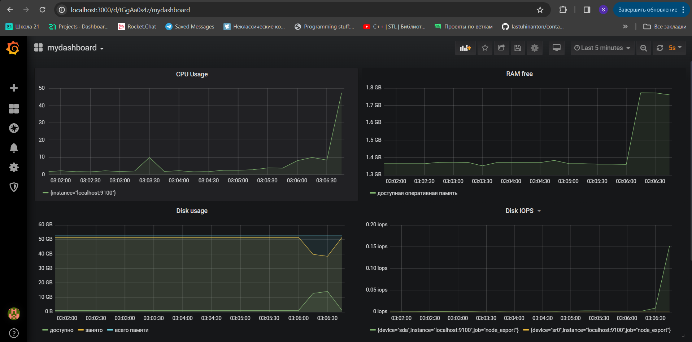

## 1. Установка Prometheus

* Для установки `Prometheus` выполним команду

`$ sudo apt install prometheus`
    
* Запустим `Prometheus`
   
`$ sudo systemctl start prometheus`

* Убедимся, что `Prometheus` запустился

`$ sudo systemctl status prometheus`


## 2. Настройка Node Exporter

`$ sudo useradd --system --no-create-home --shell /bin/false node_exporter`

`$ wget https://github.com/prometheus/node_exporter/releases/download/v1.3.1/node_exporter-1.3.1.linux-amd64.tar.gz -O - | tar -xzv -C ./`

`$ tar -xvf node_exporter-1.3.1.linux-amd64.tar.gz`

`$ sudo mv node_exporter-1.3.1.linux-amd64/node_exporter /usr/local/bin/`

`$ node_exporter --version`

`$ sudo cp node_exporter.service /etc/systemd/system/node_exporter.service`

`$ sudo systemctl daemon-reload`

`$ sudo systemctl enable node_exporter`

`$ sudo systemctl start node_exporter`

`$ sudo systemctl status node_exporter`


Создадим статическую цель для Node Exporter::

`$ sudo vim /etc/prometheus/prometheus.yml`

prometheus.yml:

```
  - job_name: node_export
    static_configs:
      - targets: ["localhost:9100"]
```


## 3. Установка Grafana 

`$ sudo apt-get install -y apt-transport-https`

`$ sudo apt-get install -y software-properties-common wget`

`$ sudo apt-get install -y adduser libfontconfig1`

`$ wget https://dl.grafana.com/oss/release/grafana_9.4.3_amd64.deb`

`$ sudo dpkg -i grafana_9.4.3_amd64.deb`

`$ sudo apt-get update && sudo apt-get -y install grafana`

`$ sudo systemctl daemon-reload`

`$ sudo systemctl enable grafana-server`

`$ sudo systemctl start grafana-server`

`$ sudo systemctl status grafana-server`

`$ sudo apt install firewalld`

`$ sudo firewall-cmd --zone=public --add-port=3000/tcp --permanent`

`$ sudo systemctl reload firewalld`   


## 4. Настройка Grafana

* В браузере перейдем по адресу `http://localhost:3000/` 

 

* При первом запуске вводим логин: `admin` и пароль: `admin`. После этого будет предложено заменить пароль

* После этого перейдем `Configuration->Data Source` и нажимаем кнопку `Add Data Source`

* В открывшемся окне выбираем тип Data Source - `Prometheus`

* В поле URL вводим адрес сервера, на котором доступен Prometheus и его порт. Так как Grafana находится на той же машине, что и Prometheus, используем `localhost`, а порт по умолчанию `9090`

   

* Сохраняем изменения `Save and Test`

## 5. Создание собственных dashboards

* Для создание dashboard нажимаем `Add panel->Add new panel`

* Создадим панель для отображения `CPU`


* Создaдим панель для отображения `доступной оперативной памяти`


    
* Создадим панель для отображения объема `всей памяти`, 


* Создадим панель для отображения `количества операций ввода/вывода на жестком диске`


* Конечный результат


## 6. Тест созданных dashboards

* Запустим bash-скрипт из `Part 2`


* Проверим результаты работы



* Установим утилиту `stress`

`$ sudo apt install stress`

* Запустим команду
   
`$ stress -c 2 -i 1 -m 1 --vm-bytes 32M -t 60s`
   
* Проверим результаты работы

