## 1. Установка готового dashboard

* Установим готовый дашборд `Node Exporter Quickstart and Dashboard` с официального сайта Grafana Labs 

https://grafana.com/grafana/dashboards/13978-node-exporter-quickstart-and-dashboard/

* Добавим дашборд в Grafana: `Dashboards->Manage->Import` и загружаем скачанный .json файл

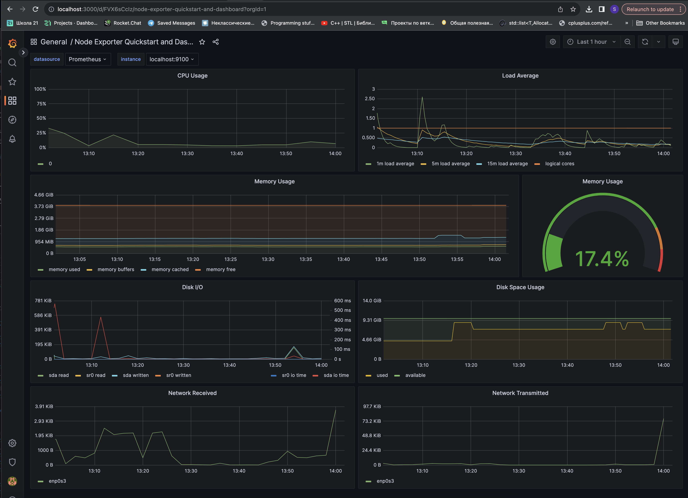

## 2. Тесты добавленного dashboard

* Запустим bash-скрипт из `Part 2`

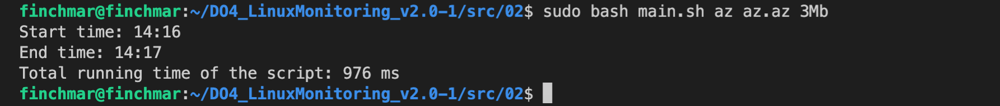

* Проверим результаты работы

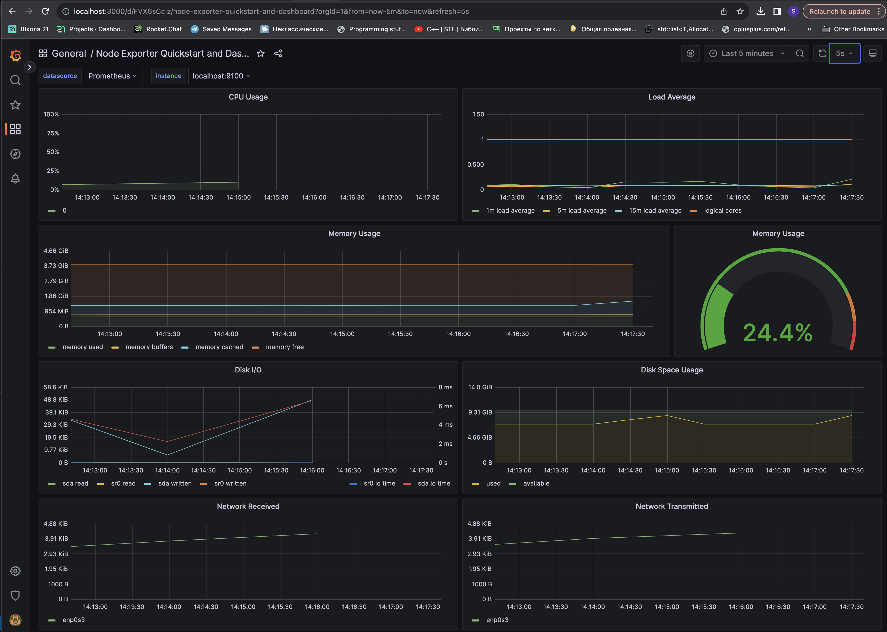

* Запустим команду

`$ stress -c 2 -i 1 -m 1 --vm-bytes 32M -t 60s`

* Проверим результаты работы

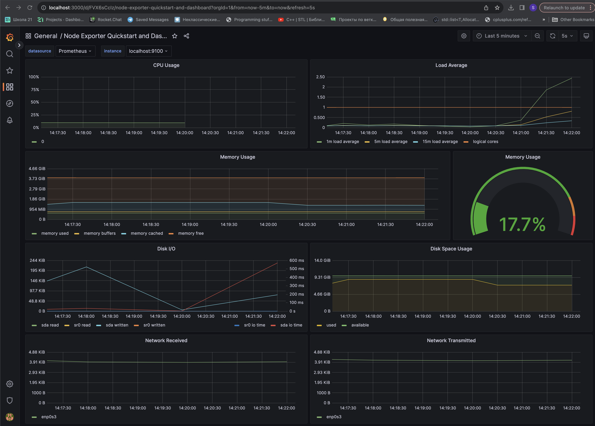

## 3. Настройка статической маршрутизации между двумя машинами

* Опишем сетевой интерфейс первой машины

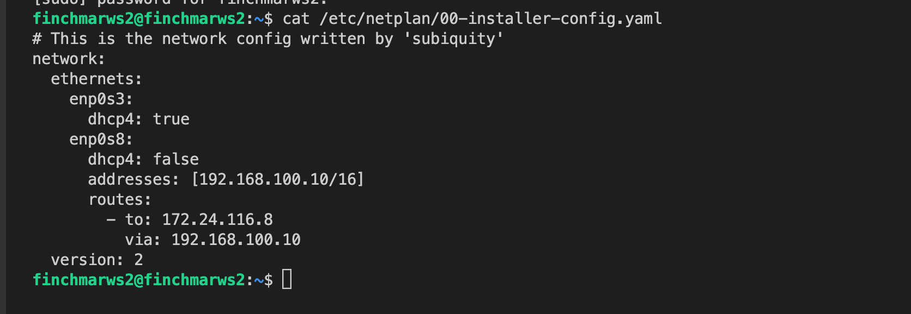

`$ sudo neplan apply`

* Опишем сетевой интерфейс второй машины

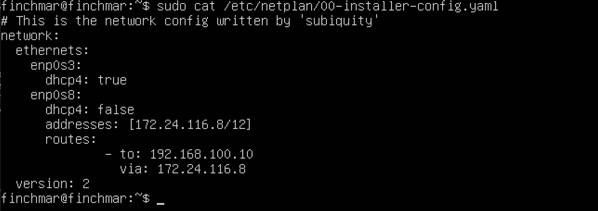

`$ sudo neplan apply`

* Проверим, что машины пингуются

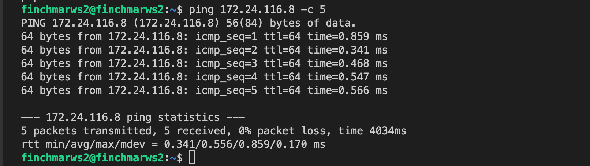

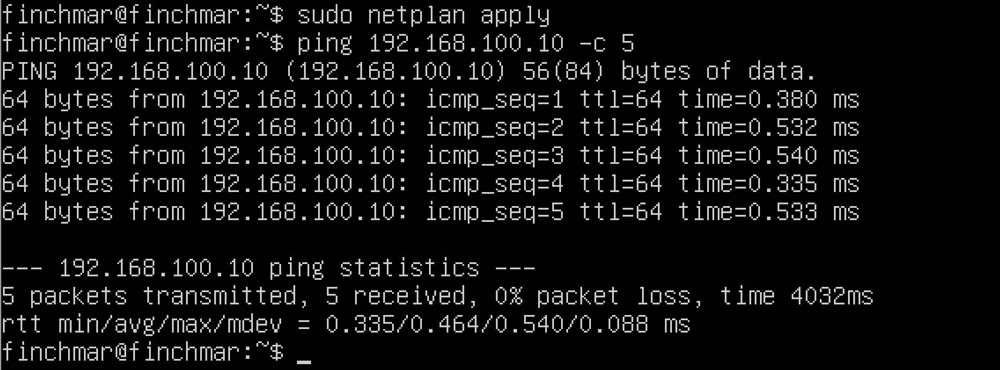

## 4. Тест нагрузки сети

* Первая машина выступает в роли сервера, выполним команду 

`$ iperf3 -s`

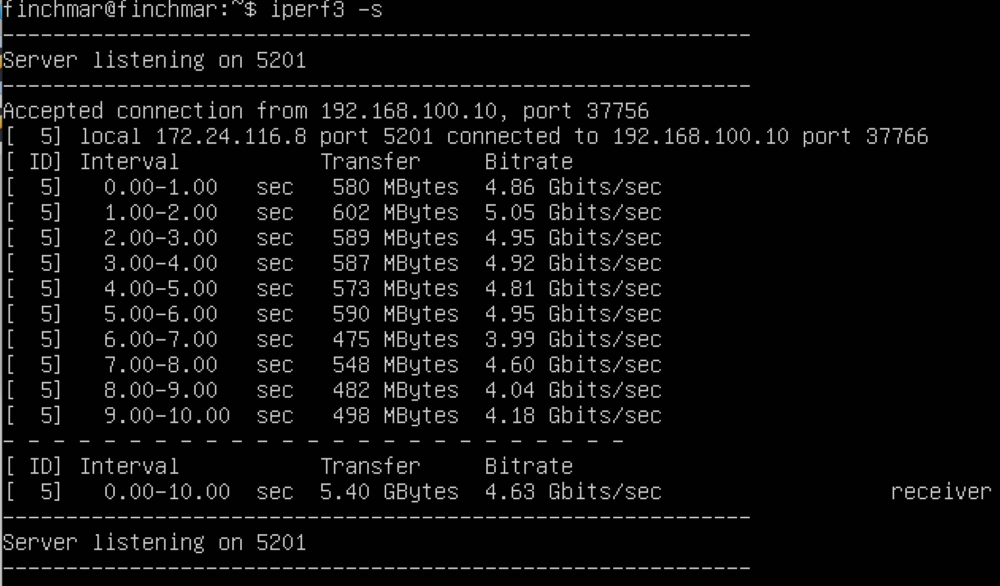

* Вторая машина выступает в роли клиента, выполним команду 
    
`$ iperf3 -c 172.24.116.8`

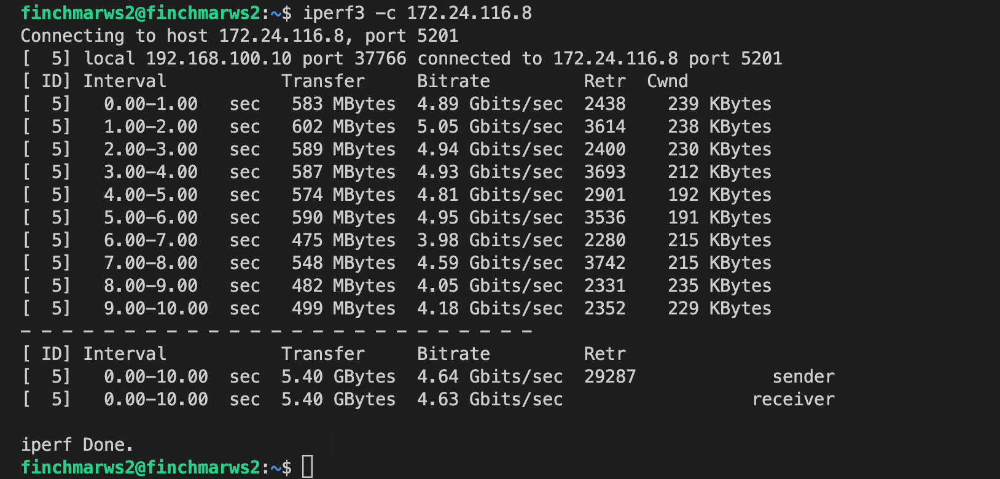

* Посмотрим на нагрузку сетевого интерфейса

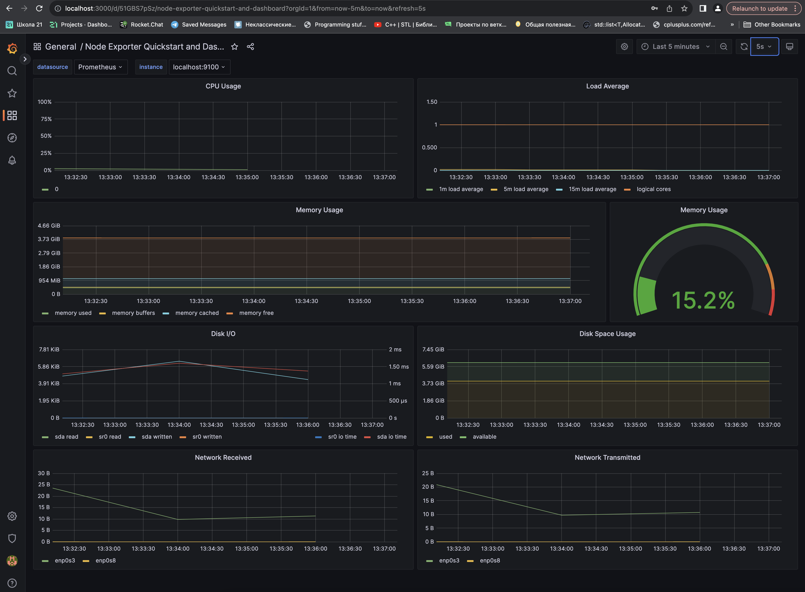
