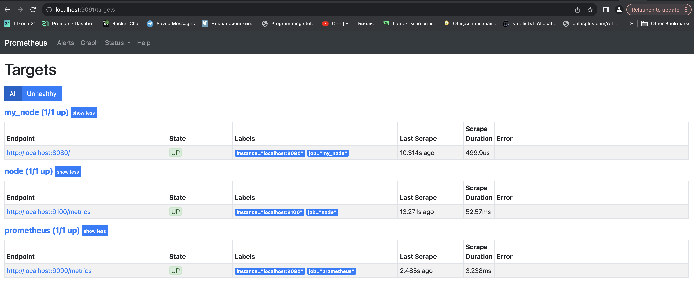
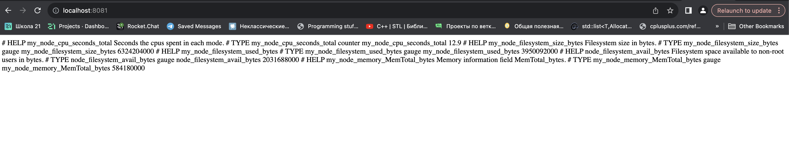
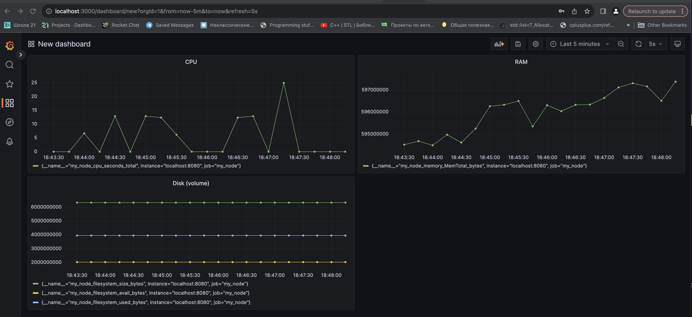
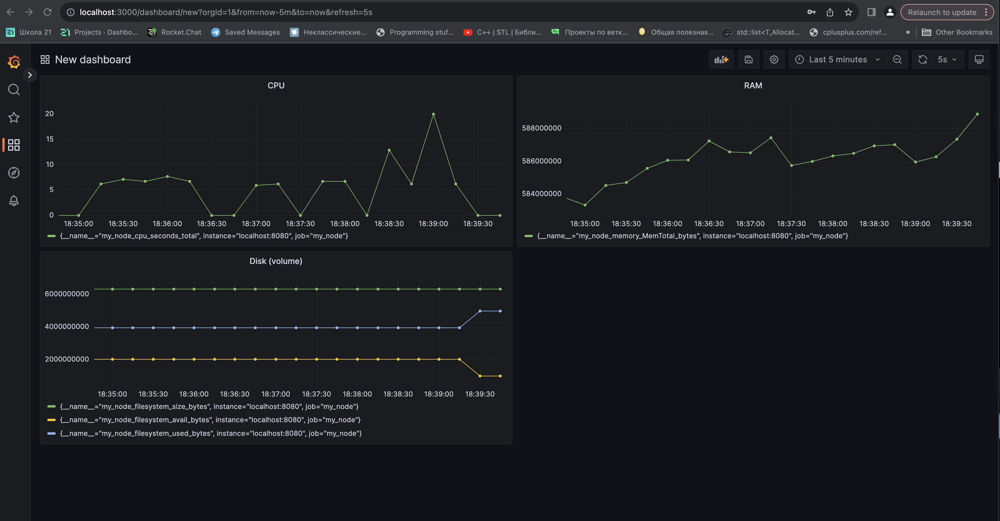
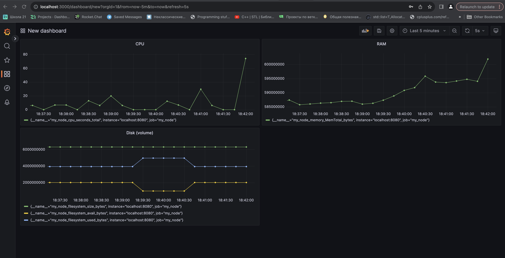

## 1. Создание bash-скриптов и изменение конфигурационных файлов

* Написать bash-скрипт или программу на С, которая собирает информацию по базовым метрикам системы (ЦПУ, оперативная память, жесткий диск (объем)).
Скрипт или программа должна формировать html страничку по формату Prometheus, которую будет отдавать nginx. 
Саму страничку обновлять можно как внутри bash-скрипта или программы (в цикле), так и при помощи утилиты cron, но не чаще, чем раз в 3 секунды.

* По адресу `http://localhost:9090/` добавились новые метрики

## 2. Проведение тестов

* Запустим bash-скрипт из `Part 2`

    
* Запустим команду

`$ stress -c 2 -i 1 -m 1 --vm-bytes 32M -t 60s`

