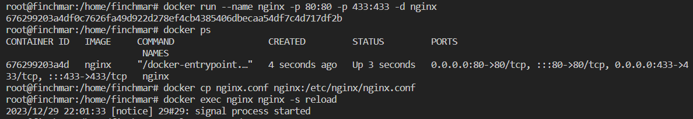

## Part 1. Готовый докер

* Скачиваем докер образ nginx через `$ docker pull nginx`:

* Проверяем наличие докер образа через `$ docker images`:

* Запустить докер образ через `$ docker run -d [image_id|repository]`:

* Проверяем, что образ запустился через `$ docker ps`:

* Посмотреть информацию о контейнере через `$ docker inspect[container_id|container_name]`:

* По выводу команды определить и поместить в отчёт:
    - размер контейнера:

    

    - список замапленных портов:

    

    - ip контейнера:
    
    

* Остановить докер образ через `$ docker stop [container_id|container_name]`

* Проверить, что образ остановился через `$ docker ps`:

* Запустить докер с замапленными портами 80 и 443 на локальную машину через команду `$ docker run -p 80:80 -p 433:433 -d nginx`:

* Проверить, что в браузере по адресу `$ localhost:80` доступна стартовая страница nginx:

* Перезапустить докер контейнер через `$ docker restart [container_id|container_name]`:

* Проверим, что контейнер запустился `$ docker ps`:

## Part 2. Операции с контейнером

* Прочитать конфигурационный файл nginx.conf внутри докер контейнера через команду `$ docker exec [container_id|container_name] cat /etc/nginx/nginx.conf`

* Создать на локальной машине файл nginx.conf. Настроить в нем по пути /status отдачу страницы статуса сервера nginx:

* Скопировать созданный файл nginx.conf внутрь докер образа через команду docker `$ docker cp nginx.conf [container_id|container_name]:/etc/nginx` Перезапустить nginx внутри докер образа через команду `$ docker exec [container_id|container_name] nginx -s reload`

* Проверить, что по адресу localhost:80/status отдается страничка со статусом сервера nginx:

* Экспортировать контейнер в файл container.tar через команду `$ docker export [container_id|container_name] > container.tar`

* Остановить контейнер:

* Удалить образ через `$ docker rmi -f [image_id|repository]`, не удаляя перед этим контейнеры:

* Удалить остановленный контейнер:

* Импортировать контейнер обратно через команду `$ docker import -c 'cmd ["nginx", "-g", "daemon off;"]' container.tar nginx:latest`

* Запустить импортированный контейнер:

* Проверим, что по адресу `localhost:80/status` отдается страничка со статусом сервера nginx:

