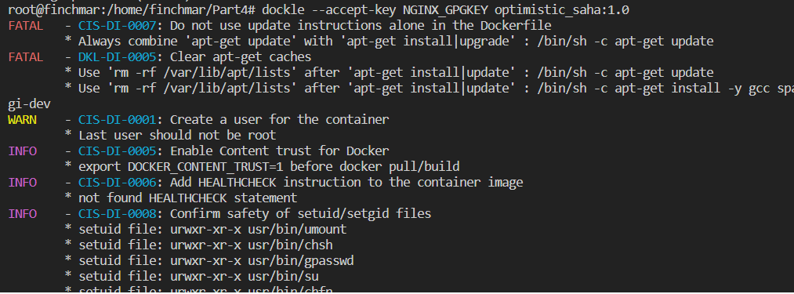

## Part 3. Мини веб-сервер
1. Напищем мини сервер на C и FastCgi, который будет возвращать простейшую страничку с надписью Hello World!, а также *nginx.conf*, который будет проксировать все запросы с 81 порта на *127.0.0.1:8080*. Для начало создадим файлы **sever.c**  

и **nginx.conf**     

2. Теперь запускаем образ и строим новый контейнер `$ docker run -d -p 81:81 nginx`:

  
3. Копируем созданные файлы 

`$ docker cp server.c [container_id|container_name]:/home`

`$ docker cp nginx.conf [container_id|container_name]:/etc/nginx/`

`$ docker exec -it [container_id|container_name] bash`

4. Для удобства скачивания необходимых библиотек откроем интерактивную командную оболочку и обновим     

5. Далее вводим следующие команды: 
    
    `$ apt-get install -y libfcgi-dev`

    `$ apt-get install spawn-fcgi`

    `$ apt-get install -y gcc`

6. Компилируем, запускаем написанный мини-сервер через *spawn-fcgi* на порту 8080 и перезагружаем

    `$ gcc server.c -o mini_server -lfcgi`

    `$ spawn-fcgi -p 8080 mini_server`

    `$ nginx -s reload`
  
7. Проверим, что в браузере по *localhost:81* отдается написанная страничка 
  

## Part 4. Свой докер
1. Напишем свой докер-образ (**Dockerfile**)    

2. Собираем  

`$ docker build -t [container_id|container_name]:1.0 .`

3. Проверяем что образ был создан 

4. Запускаем собранный докер образ с маппингом 81 порта на 80 на локальной машине и маппингом папки ./nginx внутрь контейнера по адресу, где лежат конфигурационные файлы nginx'а    

`$ docker run -it -p 80:81 -v "$PWD/nginx.conf":/etc/nginx/nginx.conf -d [container_id|container_name]:1.0 bash`

5. Проверяем, что по localhost:80 доступна страничка написанного мини сервера   

6. Допишем в ./nginx/nginx.conf проксирование странички /status, по которой надо отдавать статус сервера nginx 

7. Перезапуcкаем докер и проверяем, что теперь по localhost:80/status отдается страничка со статусом nginx 

`$ docker exec -it [container_id|container_name] /bin/bas`

`$ nginx -s reload`

## Part 5. **Dockle**
1. Установка утилиты **dockle**:

`https://habr.com/ru/companies/timeweb/articles/561378/`

2. Просканируем docker-образ из предыдущего задания на предмет наличия ошибок командой `$ dockle [image_id|repository]`:   

3. Далее исправляем конфигурационные файлы docker-образа так, чтобы при проверке через утилиту dockle не возникало ошибок и предупреждений 

создаем отдельный контейнер с тэгом part5, куда подгружаем измененные конфиги

`$ docker build -t [container_id|container_name]:part5 .`

## Part 6. Базовый **Docker Compose**

1. Напишем файл **docker-compose.yml**, с помощью которого подняли докер контейнер из Части 5, а также докер контейнер с nginx, который будет проксировать все запросы с 8080 порта на 81 порт первого контейнера  

2. Также изменили файл **nginx.conf** для докер контейнера с nginx     

3. Остановливаем все запущенные контейнеры, собрираем **docker-compose.yml**     

`$ docker stop [container_id|container_name]`

`$ docker-compose build`

4. Запускаем    

`$ docker-compose up`

5. Проверяем, что в браузере по localhost:80 отдается написанная страничка, как и ранее   

